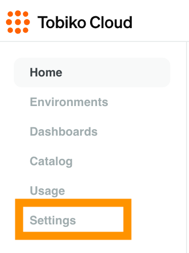

# Data Warehouse Costs and Savings with Tobiko

Cloud data warehouses can be expensive, and finance departments are paying attention. When they come asking about your cloud budget, the best preparation is a granular understanding of how your project's data pipelines map to those costs.

Cloud warehouse costs are determined by how much computation occurs. Clouds report computation/cost for each executed query, but it is challenging to align every query with a specific model in your project.

Tobiko Cloud solves this problem for you. It tracks data warehouse cost estimates per model for BigQuery and Snowflake projects that use a supported pricing plan.

This granular cost information allows you to directly explain/justify your cloud warehouse spend. It also uncovers the models that could most benefit from efficiency improvements.

Beyond tracking your warehouse costs, Tobiko Cloud estimates how much money it saved you! Its advanced column-level impact analysis saves you even more money than open-source SQLMesh.

## Supported Data Warehouse Pricing Plans

Tobiko Cloud supports these cloud pricing plans:

- BigQuery [On Demand](https://cloud.google.com/bigquery/pricing#on_demand_pricing)
- Snowflake [Credits](https://docs.snowflake.com/en/user-guide/cost-understanding-compute#label-what-are-credits)

## Data Warehouse Cost Configuration

Configure Tobiko Cloud to show cost information by navigating to the Settings page.

On the General settings page (1), select your pricing plan (2), enter your costs, and then save (3).

## Where to find cost and savings estimates information

Estimated costs and savings are displayed on the Tobiko Cloud homepage, production environment page, runs and plans pages, and individual model pages.

Cost information on each page will look similar to:

## Savings Categories

When calculating your data warehouse costs, Tobiko Cloud also estimates how much money it saved you!

Cost savings are broken up into three main categories:

- **Prevented Reruns**: If SQLMesh has already run an execution for a change in one environment, we won't need to rerun it in another environment (such as when a model change is backfilled on a development environment and then applied to prod).
- **Unaffected Downstream**: Because SQLMesh understands SQL, we know if a downstream model is not affected by an upstream change and can avoid re-execution.
- **Virtual Environments**: Using the Virtual data environments feature means new environments can be created without backfilling models within the new environment.

### Where to find cost savings information

Cost savings are shown in most of the places data warehouse costs are displayed. You can find how much Tobiko has saved you by viewing the homepage, production environment page, or individual model pages.
